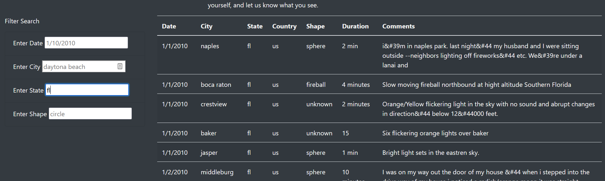
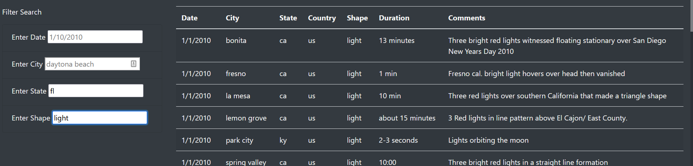
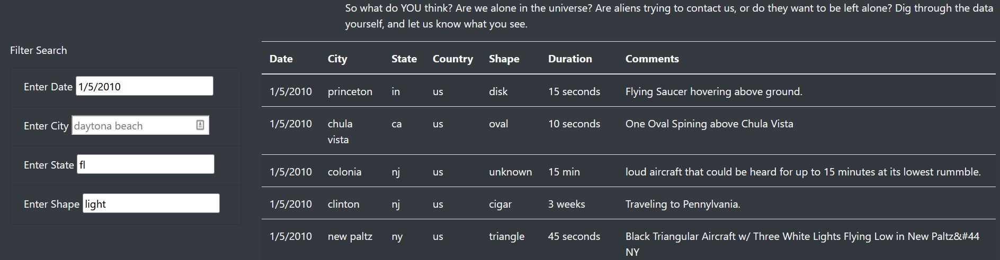

# UFOs
Using UFOs to practice JavaScript. Using JavaScript to sort through data and display data in an organized fashion. 

## Results
Dana, in order to digest the data it will best to use the search queries I have built into the site. 

Let us say that you want to narrow down sitings in florida. In order to filter out all of the other states add the abbreviation fl to the search form for State and hit enter.

To further refine the search results, add more filters options. Lets filter out the shapes now. 

Further refinement can be completed as well 

## Summary
A draw back of this design is you need to know if your search querry is contained within the data. If the querry is not within the data then you will be prompted with a blank list.

To improve on this it would be better to have a drop down list for some querry choices instead of a input box to read into. It would not hurt extending the filter options to also include duration.